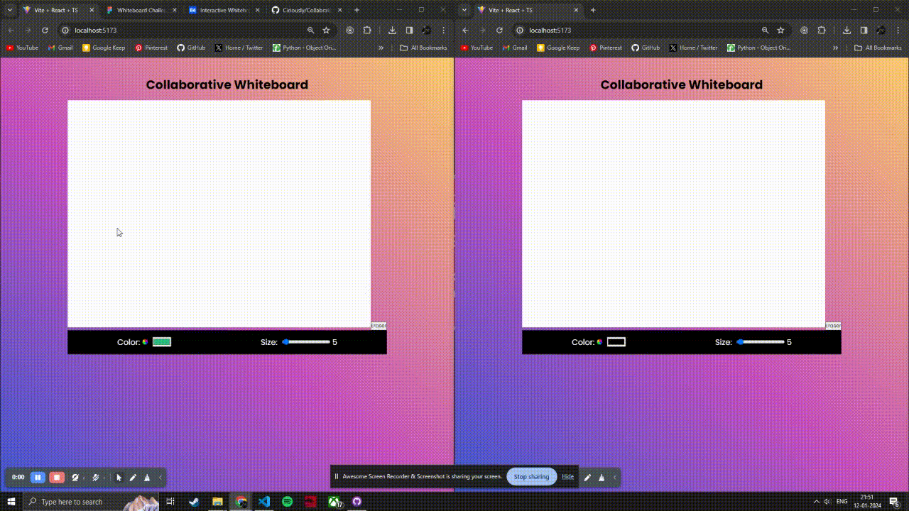

# 🎨 Collaborative Whiteboard



This is a collaborative whiteboard application built using Socket.io, Node.js, and React.js. It allows users to collaborate in real-time by drawing on a shared canvas. 🖌️🌈✨

## Features

- Real-time collaboration: Multiple users can draw on the whiteboard simultaneously and see each other's changes in real-time. 👥🔄
- Brush customization: Users can select different colors and brush widths to draw with. 🎨🔧
- Shape drawing: Users can draw various shapes such as lines, rectangles, and circles on the whiteboard. 🔳🔲🔵
- Undo/redo functionality: Users can undo or redo their drawing actions. ↩️🔁
- User presence: Users can see who else is currently connected to the whiteboard. 👥👀

## Installation

1. Clone the repository:

   ```bash
   git clone https://github.com/Ciriously/CollabrativeWhiteboard
   ```

2. Install dependencies:

   ```bash
   cd client
   npm install
   ```

   ```bash
   cd backend
   npm install
   ```

3. Start the server:

   ```bash
   npm run dev
   ```

4. Open the application in your browser:

   ```
   http://localhost:5173/
   ```

## Usage

1. Open the application in your browser.
2. Create a new whiteboard or join an existing one.
3. Start drawing on the whiteboard using the selected brush color and width.
4. Use the shape drawing tools to draw lines, rectangles, or circles.
5. Collaborate with other users in real-time by seeing their changes on the whiteboard.
6. Use the undo/redo buttons to revert or redo your drawing actions.
7. Disconnect from the whiteboard when done.

## Contributing

Contributions are welcome! If you have any ideas, suggestions, or bug reports, please open an issue or submit a pull request. 🙌🐛

## License

This project is licensed under the [MIT License](LICENSE). 📄📜
